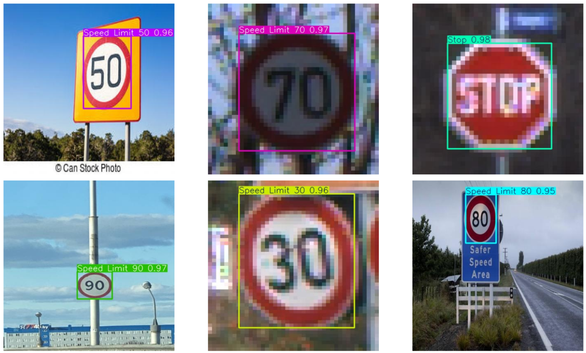
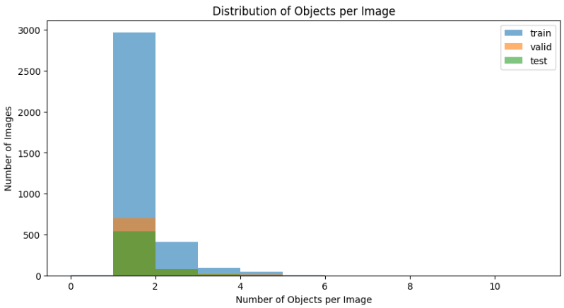
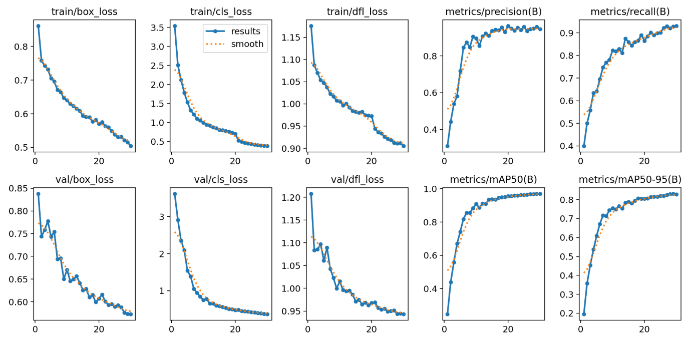
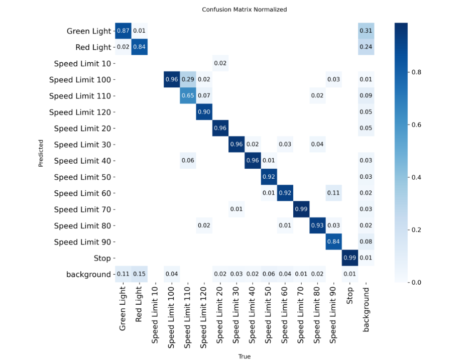
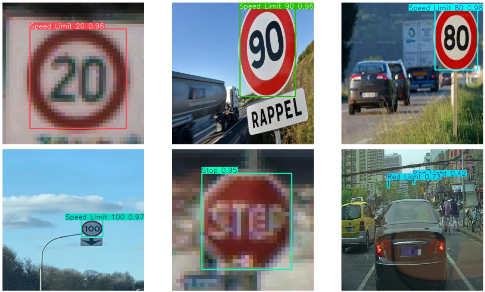
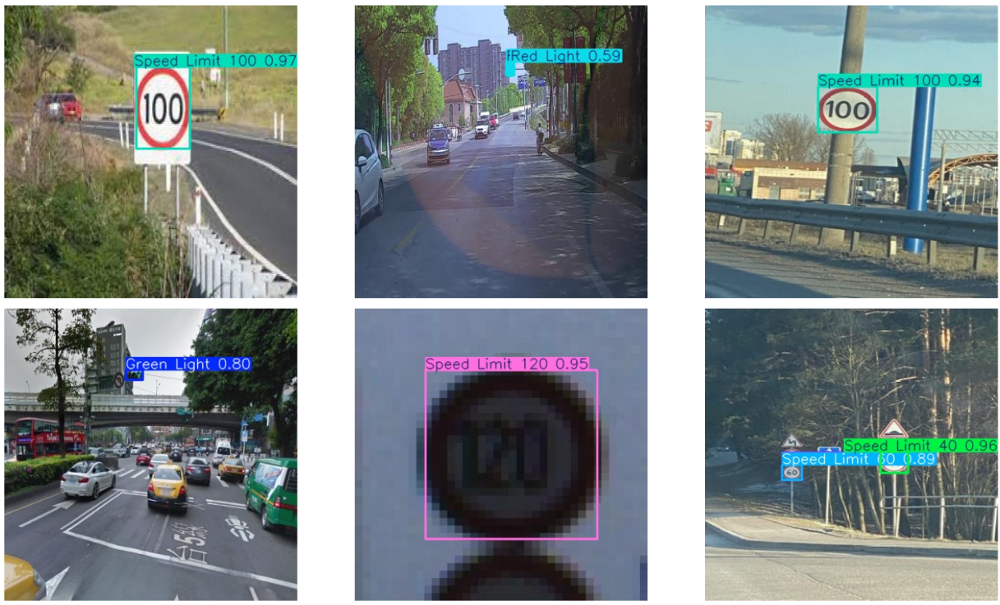

# Real-Time Traffic Sign Detection Using YOLOv8

A multi-class traffic sign detection system built with YOLOv8, covering
dataset analysis, annotation validation, model training, evaluation,
error analysis, image inference, and video detection.

## Overview

This project develops a multi-class traffic sign detection system using
the YOLOv8 object detection framework.

The project follows an end-to-end computer vision workflow, beginning
with dataset exploration and annotation validation and progressing through
model training, evaluation, error analysis, image inference, and video
detection.

The final model is capable of detecting and classifying 15 traffic-sign
categories from visual input.

## Dataset

The project uses the [Traffic Sign Detection Dataset](https://www.kaggle.com/datasets/pkdarabi/cardetection)
available on Kaggle.

The dataset contains:

- **15 traffic-sign classes**
- **3,530 training images**
- **801 validation images**
- **638 test images**
- Images are provided at **416 × 416 pixels**

### Classes

| Category | Classes |
|---|---|
| Traffic Lights | Green Light, Red Light |
| Speed Limits | 10, 20, 30, 40, 50, 60, 70, 80, 90, 100, 110, 120 |
| Other | Stop |

## Exploratory Data Analysis

The dataset was analyzed to understand class distribution, objects per
image, image dimensions, and bounding-box characteristics before training.

All images share a consistent 416 × 416 resolution, while the bounding-box
analysis revealed the presence of very small objects that can be challenging
for detection.

## Model

The project uses the pretrained **YOLOv8n** model and fine-tunes it for
the 15-class traffic-sign detection task.

| Configuration | Value |
|---|---|
| Model | YOLOv8n |
| Task | Object Detection |
| Input Size | 640 × 640 |
| Epochs | 30 |
| Batch Size | AutoBatch |
| Optimizer | Auto |
| Hardware | NVIDIA Tesla T4 |

## Training

The model was trained using transfer learning from pretrained YOLOv8
weights.

Training performance was monitored using bounding-box loss, classification
loss, distribution focal loss, precision, recall, and mean Average Precision.

## Results

The trained model was evaluated on the unseen test set.

| Metric | Test Performance |
|---|---:|
| Precision | 0.853 |
| Recall | 0.907 |
| mAP@50 | 0.924 |
| mAP@50–95 | 0.782 |

The model demonstrated strong overall detection performance, with high
recall indicating that most annotated traffic signs were successfully
detected. The stricter mAP@50–95 score also highlights the additional
challenge of achieving precise bounding-box localization.

## Error Analysis

Class-level evaluation and qualitative inspection were used to identify
where the model performs well and where detection remains challenging.

The analysis showed stronger performance for several speed-limit and stop
sign categories, while small traffic-light objects and visually similar
or distant signs presented greater challenges.

## Qualitative Results

The trained model was tested on previously unseen images to examine its
practical detection behavior.

### Example 1

### Example 2

### Example 3

## Video Inference

The trained YOLOv8 model was also applied to video input to demonstrate
continuous traffic-sign detection.

  

The model successfully performed frame-by-frame detection on the test
video, demonstrating its ability to process continuous visual input rather
than only individual images.

## Limitations

- Very small or distant traffic signs are more difficult to detect.
- Some classes contain relatively fewer training examples.
- Performance may vary under different lighting, weather, camera, and
  traffic conditions.
- The model has been evaluated primarily on the provided dataset and
  selected video input rather than a broad real-world benchmark.

## Future Improvements

- Improve small-object detection through higher-resolution training and
  targeted augmentation.
- Increase the number and diversity of examples for underrepresented classes.
- Evaluate the model across more diverse real-world traffic conditions.
- Compare larger YOLOv8 variants when additional computational resources
  are available.
- Optimize the model for deployment on resource-constrained hardware.

## Project Notebook

The complete end-to-end implementation, including dataset analysis,
training, evaluation, error analysis, and inference, is available in the
[Jupyter Notebook](real-time-traffic-sign-detection-using-yolov8.ipynb).

## Technologies

- Python
- PyTorch
- Ultralytics YOLOv8
- OpenCV
- NumPy
- Pandas
- Matplotlib
- Kaggle GPU

---

© 2026 Mostafizur Rahman

